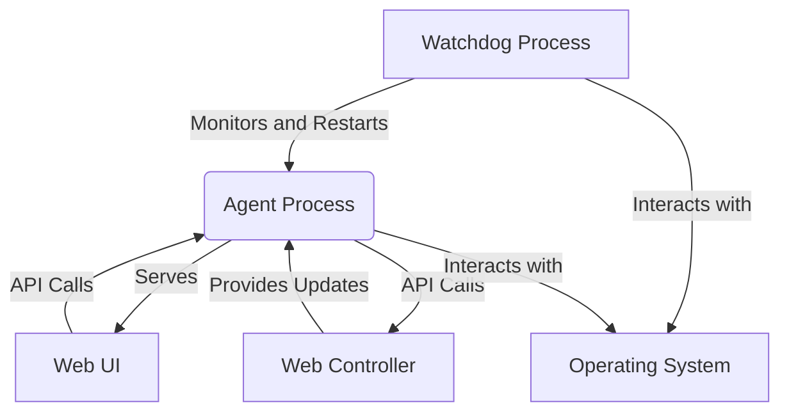

# Agent Watchdog Architecture

## Introduction

This document outlines the architectural design for the `agent-watchdog` project. The primary goal is to ensure the continuous running and availability of the Arcade Agent process on arcade machines. The architecture focuses on scalability, security, and modularity, building upon the existing Agent functionality and introducing a dedicated watchdog component.

## Overall Architecture

The proposed architecture consists of two main, independent processes: the **Watchdog Process** and the **Agent Process**. The Watchdog Process is responsible for monitoring the health and running status of the Agent Process and restarting it if necessary. The Agent Process continues to handle its existing responsibilities, including communication with the Web Controller, managing LaunchBox, serving the Web UI, and handling its own updates.

This separation of concerns enhances modularity, testability, and resilience. If the Agent Process crashes, the Watchdog can restart it without affecting the Watchdog's operation.

## Component Descriptions

1.  **Watchdog Process:**
    *   **Responsibility:** Monitor the Agent Process, detect failures, and initiate restarts.
    *   **Key Functions:**
        *   Periodically check if the Agent Process is running.
        *   Identify the Agent Process (e.g., by process name or ID).
        *   Log watchdog activity (start, stop, restart attempts).
        *   Interact with the operating system to manage the Agent Process lifecycle.
    *   **Technology:** Could be implemented as a lightweight script or a compiled executable, depending on the required robustness and platform.

2.  **Agent Process:**
    *   **Responsibility:** The core application running on the arcade machine.
    *   **Key Functions:**
        *   Run the Flask web server.
        *   Handle API requests from the Web Controller and Web UI.
        *   Manage LaunchBox interactions (game listing, launching, etc.).
        *   Check for and apply agent updates.
        *   Serve the Web UI static files.
        *   Provide system status information.
    *   **Technology:** Existing Python application (`agent.py`) using Flask.

3.  **Web Controller:**
    *   **Responsibility:** Remote server for managing and updating agents.
    *   **Key Functions:**
        *   Provide the latest agent version information.
        *   Serve the latest agent executable for download.
        *   Potentially receive status updates from agents.
    *   **Technology:** Existing web application (`arcade-controller`).

4.  **Web UI:**
    *   **Responsibility:** User interface for monitoring and controlling the agent on a specific machine.
    *   **Key Functions:**
        *   Display agent status, logs, and system information.
        *   Provide controls for agent functions (e.g., starting/stopping BigBox).
    *   **Technology:** Existing React application.

## Interactions



*   **Watchdog -> Agent:** The Watchdog checks the Agent's status. This can be done by querying the OS for the process status or by the Watchdog making a simple request to a dedicated "heartbeat" endpoint exposed by the Agent's Flask server.
*   **Watchdog -> Operating System:** The Watchdog uses OS-level commands or APIs to check if the Agent process is running and to start it if needed.
*   **Agent <-> Web Controller:** The Agent initiates communication to check for updates and download new versions. The Web Controller can initiate communication to send commands to the Agent via its API.
*   **Web UI <-> Agent:** The Web UI, served by the Agent, communicates with the Agent's API to retrieve data and send commands based on user interaction.

## Data Flow and State Management

*   **Agent Status:** The Agent maintains its operational state (running tasks, system info, version). This is primarily managed within the Agent Process and exposed via its API for the Web UI and potentially the Web Controller.
*   **Watchdog Status:** The Watchdog's state is simpler, mainly tracking the Agent's running status and its own operational state (e.g., last check time, restart count). This could be logged by the Watchdog process.
*   **Update Information:** The Agent pulls update information from the Web Controller.

## Error Handling and Resilience

*   **Agent Process Failure:** The core resilience mechanism is the Watchdog detecting Agent failure and restarting it.
*   **Watchdog Process Failure:** To ensure the Watchdog itself is resilient, it could be configured to run as a system service (e.g., using `systemd` on Linux or a Windows Service) which the OS would manage and restart if it fails.
*   **Communication Errors:** The Agent's API and update mechanisms should include error handling for network issues or invalid responses.
*   **Resource Exhaustion:** The Watchdog could potentially monitor Agent resource usage (CPU, memory) and restart the Agent if it exceeds predefined thresholds, although this adds complexity.

## Security Considerations

*   **Process Management Permissions:** The Watchdog must have the necessary permissions to monitor and restart the Agent process. These permissions should be as restricted as possible.
*   **Secure Updates:** The Agent's update process should verify the integrity and authenticity of downloaded updates (e.g., using digital signatures) to prevent the execution of malicious code.
*   **API Security:** The Agent's API should be protected, especially if accessible from outside the local network. Measures like API keys, authentication, or restricting access to trusted sources should be considered.
*   **Configuration Security:** Sensitive configuration data (if any) should be stored securely and not hardcoded.

## Modularity

*   The clear separation of the Watchdog and Agent into distinct processes is the primary driver of modularity.
*   Within the Agent, the existing separation into modules (`api_routes.py`, `filesystem_utils.py`, etc.) promotes internal modularity.
*   Configuration should be externalized to make components more independent and testable.

## Mapping to Project Structure

*   `arcade-agent/`: Contains the code for the Agent Process (`agent.py`, `api_routes.py`, utility modules, etc.).
*   `agent-watchdog/`: A new directory to contain the code for the Watchdog Process.
*   `doc/`: Contains documentation, including this architecture document.
*   Configuration files (e.g., for Watchdog settings, Agent settings) could be placed in a dedicated `config/` directory at the project root or within the respective component directories.

## Architectural Diagram

```mermaid
graph TD
    A[Watchdog Process] -->|Monitors and Restarts| B(Agent Process)
    B -->|Serves| C[Web UI]
    B -->|API Calls| D[Web Controller]
    D -->|Provides Updates| B
    C -->|API Calls| B
    A -->|Interacts with| E[Operating System]
    B -->|Interacts with| E