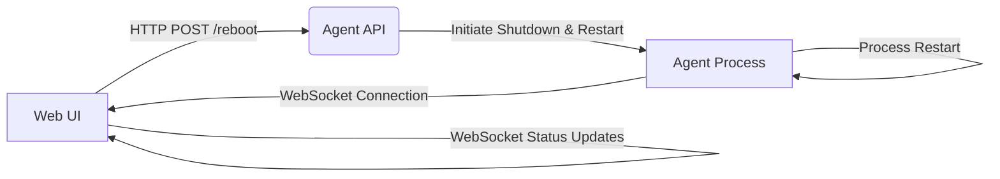

# Reboot Feature Architecture Design

## 1. Introduction

This document outlines the architecture design for the reboot button feature, based on the provided specification (`doc/reboot_feature_spec.md`) and pseudocode (`doc/reboot_feature_pseudocode.md`). The feature allows users to gracefully reboot the agent process from the web user interface.

## 2. System Diagram

The following diagram illustrates the main components and their interactions in the reboot process:

**Explanation:**

*   **Web UI:** The user interface where the "Reboot Agent" button is located. It initiates the reboot process by sending an HTTP POST request to the Agent API. It also handles visual feedback and attempts to reconnect via WebSocket after the reboot.
*   **Agent API:** A component within the Agent Process that listens for incoming HTTP requests. It receives the reboot request, performs validation, initiates the shutdown process within the Agent Process, and sends a response back to the Web UI.
*   **Agent Process:** The core application running on the user's machine. It handles the graceful shutdown, resource release, and process restart. It also maintains a WebSocket connection with the Web UI for status updates.

## 3. Service Boundaries

The reboot feature involves interactions between the following services/components:

*   **Web UI (Frontend):**
    *   Responsible for rendering the reboot button and visual feedback.
    *   Handles user interaction (button clicks).
    *   Communicates with the Agent API via HTTP for initiating the reboot.
    *   Manages WebSocket connection for receiving agent status updates and handling reconnection logic.
    *   Implements retry mechanisms for WebSocket reconnection with exponential backoff.

*   **Agent API (Backend/within Agent Process):**
    *   Exposes an HTTP endpoint (e.g., `/reboot`) to receive reboot requests from the Web UI.
    *   Performs authentication and authorization checks to ensure only authorized users can initiate a reboot.
    *   Checks if the agent is currently busy and returns a conflict error if necessary.
    *   Triggers the graceful shutdown and restart sequence within the Agent Process.
    *   Returns an appropriate HTTP response (success or error) to the Web UI.

*   **Agent Process (Backend):**
    *   Manages its own lifecycle, including graceful shutdown and restart.
    *   Implements logic to stop accepting new requests and finish current tasks during shutdown.
    *   Handles resource release (file handles, database connections, etc.).
    *   Includes error handling and logging for shutdown and restart failures.
    *   Potentially includes logic for forceful termination if graceful shutdown fails.
    *   Maintains a WebSocket server to communicate status updates to the Web UI.
    *   Saves and loads critical state during shutdown and restart to ensure data integrity.

## 4. Data Flow

1.  User clicks the "Reboot Agent" button in the Web UI.
2.  The Web UI disables the button, displays visual feedback, and sends an HTTP POST request to the Agent API's `/reboot` endpoint.
3.  The Agent API receives the request, performs validation (authentication, authorization, busy check), and if successful, initiates the graceful shutdown process within the Agent Process.
4.  The Agent API sends a success response back to the Web UI. If validation fails, an error response is returned.
5.  The Agent Process stops accepting new requests, finishes current tasks, and releases resources.
6.  Upon successful graceful shutdown, the Agent Process initiates a self-restart.
7.  The Web UI, upon receiving the success response, starts a timer and attempts to reconnect to the Agent's WebSocket after a delay.
8.  The restarted Agent Process initializes, loads saved state, and starts accepting new requests and establishes a WebSocket connection.
9.  The Web UI successfully reconnects to the WebSocket, updates its status based on the agent's state, re-enables the reboot button, and hides the visual feedback.
10. If WebSocket reconnection fails, the Web UI retries with increasing delays up to a maximum number of attempts. If all attempts fail, a persistent error message is displayed.

## 5. Edge Case Handling

The architecture design incorporates handling for the identified edge cases:

*   **Agent fails to shut down/restart:** The Agent Process includes logging and potential forceful termination. System-level monitoring could be implemented to detect persistent failures.
*   **Web UI fails to reconnect:** The Web UI implements a robust retry mechanism with exponential backoff and a persistent error message after maximum attempts.
*   **Multiple button clicks:** The Web UI disables the button after the initial click.
*   **Agent busy:** The Agent API returns a conflict error, and the Web UI handles this by displaying an error message and re-enabling the button.
*   **Network connection lost:** The WebSocket reconnection logic in the Web UI handles this scenario.

## 6. Constraints Adherence

The architecture design adheres to the specified constraints:

*   **No manual intervention:** The entire reboot process is designed to be initiated and completed programmatically.
*   **Fast reboot:** Graceful shutdown prioritizes data integrity while aiming for efficiency.
*   **Responsive web UI:** The UI remains responsive by handling API calls and WebSocket connections asynchronously and providing visual feedback without blocking the main thread.
*   **Security:** Authentication and authorization checks are included at the Agent API level.
*   **Programmatic reboot support:** The design assumes the underlying operating system supports the necessary operations for process shutdown and restart.